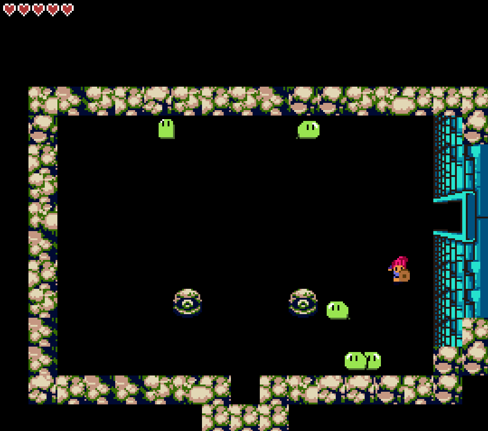

# Yazelc (yet another zelda clone)

A zelda-like adventure game in python.

This is still a work in progress. I've excluded the assets so you can only explore the codebase.

# Preview

 

  

 

  

## Requirements

* python >= 3.8
* pygame
* esper == 2.5
* pyTMX

## Credits

Sprite assets are based mainly on the work of [lunarsignals](https://lunarsignals.itch.io/) and these are distributed under
the [Creative Commons Attribution-ShareAlike 4.0 International](https://creativecommons.org/licenses/by-sa/4.0/)